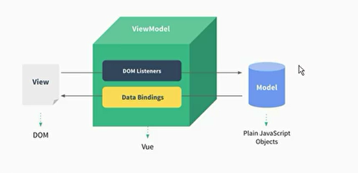

vue对象

vue对象代理了data里的属性和methods里的属性

methods访问data里的属性直接使用this, app访问data里的属性直接访问

const app=new Vue({el, data, methods})

el: 字符串或者dom节点，字符串会通过document.querySelector来转成dom节点

data: 对象或者函数

methods: 函数对象

### mvvm

mvvm



双向数据绑定，vue将dom事件传递给回调函数，{{}} 将数据绑定到dom

### 插值语法

#### Mustache

和react的模板字符串一样 {{ firstname + lastname}} {{count*2}}

内部变量名会被替换其他字符保持原样，并且可以运算

#### v-once

标签内数据只会绑定一次， const一样

```js
<h2 v-once>{{message}}</h2>
```

#### v-html

数据内容是html, 展示时候不是字符串，而是解析后html标签

v-html='需要展示的数据的变量名', 内容被渲染在h2标签里的所有内容，如果原本就有内容直接覆盖

```js
<h2 v-html='url'></h2>
```

#### v-pre

将标签内容部分按照字符串展示不需要解析，将数据填入

```js
<h2 v-pre>{{message}}</h2>
```

#### v-cloak

在vue解析之前标签内由v-cloak属性,标签就会隐藏，vue解析创建对象，会将v-cloak属性删除, 如果js解析慢，也不会展示{{message}}这样的字符串

```css
[v-cloak]{
	display: none;
}
```

```js
<div id='app' v-cloak></div>
```


### v-bind:

v-bind: 可以把属性值里的字符串和数据绑定,也可以是函数，但是需要写括号调用, 缩写就是一个:

```js

<a :href='aHref'>百度一下</a>
<button :disabled='!isAgree'/>
data:{
	imgURL: 'http://xxx',
	aHref: 'http://xxx',
    isAgree: false,
}
```

#### 动态className

对象语法和数组语法

react里可以用classnames包，vue用v-bind就可以

class 可以写一个对象，里面key是类名，值是data里的boolean值

class 可以写多个

```js
<h2 class='title' :class='{active: isActive, line: isLine}'></h2>
data:{
    isActive: true,
    isLine: false,
}
```

```js
<h2 class='title' :class='titleClass()'></h2>
data:{
    isActive: true,
    isLine: false,
}
methods:{
    titleClass(){
        return {active: isActive, line: isLine}
    }
}
```

```js
<h2 class='title' :class="['active', 'line']"></h2>
```

#### css选择器之间的 空格和逗号

当两个选择器之间有空格的情况下，代表的是子类选择器

```
.a .b{}
```

代表的是a类的b子类

而两个选择器之间没有空格的情况下，代表的是同时拥有两个类名的标签

```
<div class="a b"></div>
.a.b{}
```

当两个选择器之间是逗号的情况下，代表的是选择了两个类选择器

```
<div class="a"></div>
<div class="b"></div>
.a,.b{}
```

#### 动态绑定style

style标签里可以写对象，并且可以解析data里的数据到里面去

同样，可以写一个函数调用

```js
<h2 :style='{fontSize: finalSize+"px"}'>{{message}}</h2>
data:{
    finalSize: 100,
}
```

数组语法，由于class可以写多个，style只能写一个，数组语法可以预填写一个基础样式对象。

```js
 <h2 :style='[baseStyle, {fontSize: finalSize+"px"}]'>{{message}}</h2>
  const app=new Vue({
            el: '#app',
            data: {
                finalSize: 100,
                baseStyle: {color: "red"},
            }
        })
```


### v-for

可以遍历产生多个当前标签，每次数据都是遍历的第几个数据

产生的item, index可以在当前标签的其他带解析的位置上用

```js
<li v-for="(item, index) in movies"></li>
data:{
    movies:['xx','ee']
}
```

```js
<!DOCTYPE html>
<html lang="en">
<head>
    <meta charset="UTF-8">
    <meta name="viewport" content="width=device-width, initial-scale=1.0">
    <title>Document</title>
    <style>
        .red{
            color: red;
        }
    </style>
</head>
<body>
    <div id='app'>
        <li v-for='(item, index) in movies' :class="{red: index===activeIdx}">{{item}}</li>
    </div>
    <script src='./vue.js'></script>
    <script>
        const app=new Vue({
            el: '#app',
            data: {
                movies: ['aaa','bbb','ccc','ddd'],
                activeIdx: 1
            }
        })
    </script>
</body>
</html>
```

遍历对象, 对象是key:value集合

```js
<li v-for='value in  info'>{{item}}</li>  
<li v-for='(value, key) in  info'>{{item}}</li>
<li v-for='(value, key, index) in  info'>{{item}}</li>
```

#### key

key值要和节点内容相关，唯一标识，为什么不能用index作为key, 因为diff算法，会维护dom节点集合，判断新tree里的key在原来树中是否存在，如果存在就可以复用，不存在才创建，如果使用index,如果在中间插入元素，后面的index全变了，全部不能复用了，key要和item相关

#### 修改数组某一项不更新

因为修改数组项，但是数组对象没有改变，数组长度也没有改变，

```js
 // 使用新对象
 <div id='app' v-cloak>
        <li v-for='value in letters'>{{value}}</li>
        <button @click='change'>click</button>
    </div>
    <script src='./vue.js'></script>
    <script>
        const app=new Vue({
            el: '#app',
            data: {
                letters: ['a','b','c','d','e']
            },
            methods:{
                change(){
                    let newLetters=[...this.letters]
                    newLetters[0]='xxx'
                    this.letters=newLetters
                }
            }
        })
    </script>
```

```js
// 使用Vue.set方法设置值 
change(){
  Vue.set(this.letters, 0, 'xxx')
 }
```

```js
// 使用先删除在插入方法
change(){
  this.letters.splice(0, 1, 'xxxx')
}
```


### 计算属性

相当于react里, 在render之前计算并定义了变量

```js
<h2>{{fullName}}</h2>
 const app=new Vue({
            el: '#app',
            data: {
                firstName: 'll',
                lastName: 'pp'
            },
            computed: {
                fullName: function(){
                    return this.firstName+this.lastName
                }
            }
        })
```

相当于,是一种简单写法

```js
 const app=new Vue({
     el: '#app',
     data: {
         firstName: 'll',
         lastName: 'pp'
     },
     computed: {
         fullName: {
             set(){

             },
             get(){
                 return this.firstName+this.lastName
             }
         }
     }
 })
 // 可以定义set
  set(newValue){
      const names=newValue.split(' ')
      this.firstName=names[0]
      this.lastName=names[1]
  },
```

### v-on

缩写@, 可以直接写表达式一般一句的这么操作，写函数，methods里面函数对应

可以直接写表达式

```js
<button @click='count++'>+</button>
<button @click='increment'>+</button>
<button @click='isShow=!isShow'>toggle</button>

methods:{
    increment(){
        this.count++
    }
}
```

event默认传入，在标签里不要显示传入

```js
<button @click='click'>+</button>
methods:{
    click(event){
        console.log(event)
    }
}
```

手动传入event, 使用$event

```js
<button @click='click(123, $event)'>+</button>
methods:{
    click(a,event){
        console.log(a,event)
    }
}
```

#### 修饰符

##### .stop

stop修饰的方法相当于内部写了 e.stopPropagation()

阻止事件冒泡

```js
<button @click.stop='click(123, $event)'>+</button>
```

##### .prevent

相当于e.preventDefault(), 阻止默认事件

可以连着写

@click.stop.prevent

##### .{keyCode|keyAlias} 

事件从特定键触发时才触发回调,键盘代码或者修饰符

比如输入回车时候触发

```js
<input type='text' @keyup.enter='onEnter'>
<input type='text' @keyup.13='onEnter'>
methods:{
	onEnter(){
		console.log('enter')
	}
}
```

##### .once

只会触发一次

### 条件判断

v-if 如果值为true, 当前标签内容渲染，否则不渲染

不渲染指的是内存中和dom树中都不存在节点，和v-show不同

```js
<h2 v-if='isShow'>......</h2>
data:{
    isShow: false,
}
```

配合v-else 可以实现未加载显示loading, react三元运算符

```js
<h2 v-if='isShow'>...</h2>
<h3 v-else>...</h3>
```

#### 重渲染不会刷新运行时内容值

如果v-if, v-else渲染的内容类似，vue的虚拟dom会比对更新dom属性值，但是dom的运行时的值不会更新，比如input框里的字，不如audio里的音频，之所以每次render，音频还会继续播放而不是从头播放，之所以v-else显示了，dom节点改变，但是input框的内容没有改变，运行时的值不会改变，只会改变dom节点的属性

解决办法可以在两个组件加不同的key值

### v-show

相当于react中加了一个hidden的className, 里面时display:none,

组件没有卸载只是隐藏了，存在dom树中，多了个css样式，不是不存在，没显示出来而已，

visibility: hidden----将元素隐藏，bai但是在网页中该占的位置du还是占着。

display: none----将元素的显示设为无，即在网页中不占任何的位置。

visibility: hidden和display: none 的dom元素是存在dom树中的，只是加了个style

```js
<h2 v-show='isShow'>......</h2>
```

v-if会节省性能不解析渲染，v-show要解析渲染

### 过滤器

过滤器就是执行了一个函数将值返回出来，相比执行函数，更加语义化

```js
<h2>{{item.price | showPrice}}</h2>
const app=new App({
    ...
    filters:{
        showPrice(price){
            return '￥'+price.toFixed(2)
        }
    }
})
```

### v-model

#### 输入框

双向数据绑定, 用于表单，表单每个标签需要一个name, 一个value，用于提交收集信息。v-model会将当前标签的value绑定到对应的变量上

```js
<input type='text' v-model='message' />
// 将输入框onChange时候数据绑定给message, message绑定到input的value
// @input  input事件，看的是事件  e.target.value绑定到message
```

#### radio标签

radio标签， 没有v-model必须要写相同的name属性，这样才能互斥

有v-model, 就相当于有name属性，会根据对应data里的值，选对应value的radio，data里的值是从value里选的

```js
<label for='male'>
    <input type='radio' id='male' /*name='sex'*/ value='男' v-model='sex'> 男
</label>
<label for='female'>
    <input type='radio' id='female' /*name='sex'*/ value='女' v-model='sex'> 男
</label>
data:{
    sex: '男'  // '男'/'女'
}
```

#### 单选框

单选框的value就是true, false

label的for和里面的id写一样，这样点击字的时候也能选中

```js
<label for='agree'>
    <input type='checkbox' id='agree' v-model='isAgree'>同意协议
</label>
data:{
    isAgree: false,
}
```

#### 多选框

需要手动定义value, 对应的data是个数组

当选中时就会将value放入data里的那个数组，取消就删除

```js
<label for='basketball'>
    <input type='checkbox' id='basketball' value='篮球' v-model='hobbies'>篮球
</label>
<label for='football'>
    <input type='checkbox' id='football' value='足球' v-model='hobbies'>足球
</label>
<label for='pingpang'>
    <input type='checkbox' id='pingpang' value='乒乓球' v-model='hobbies'>乒乓球
</label>
data:{
    hobbies: [],
}
```


#### 单选下拉

select里写v-model，对应变量和选中的option的value绑定

```js
<select name='abc' id='' v-model='fruit'>
    <option value='苹果'>苹果</option>
	<option value='香蕉'>香蕉</option>
	<option value='榴莲'>榴莲</option>
	<option value='葡萄'>葡萄</option>
</select>
data:{
    fruit: '香蕉'
}
```

#### 多选下拉

对应变量是个数组，包含的值对应选中option的value

```js
<select name='abc' id='' v-model='fruit' multiple>
    <option value='苹果'>苹果</option>
	<option value='香蕉'>香蕉</option>
	<option value='榴莲'>榴莲</option>
	<option value='葡萄'>葡萄</option>
</select>
data:{
    fruit: []
}
```

#### 值绑定

v-for 循环出来

```js
<label v-for='item in originHobbies' :for='item'>
 	<input type='checkbox' :value='item' :id='item' v-model='hobbies'>{{item}}
</label>

data:{
    hobbies: [],
    originHobbies:['篮球','足球','乒乓球']
}
```

#### 修饰符

.lazy

输入框，是实时绑定的，需求，敲回车或者点击其他地方导致失去焦点，才将数据填入data的变量里

.number

v-model 默认会将输入框的数字以字符串形式填入data里的变量

```js
<input type='number' v-model.number='age'>

data:{
    age: 0
}
```

.trim

输入左右空格去掉，然后再填入data