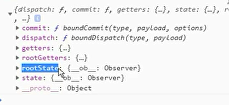

### vuex

#### 基本步骤

```js
import Vuex from 'vuex'
import Vue from 'vue'

// 安装路由
Vue.use(Vuex)

const store=new Vuex.Store({
   
})
export default store

// main.js
import Vue from 'vue'
import App from './App.vue'
import router from './router'
import store from './store'

Vue.config.productionTip = false

new Vue({
  router,
    store,
  render: h => h(App),
}).$mount('#app')

```

#### 获取值

{{$store.state.count}}

this.$store.state包含所有数据

#### 提交修改

定义state, mutations

mutations就像react的reducer

mutaions里面定义了方法actionType: action

用的时候this.$store.commit('方法名称'), 方法名称就是actionType

```js
const store=new Vuex.Store({
   state:{
       count: 100,
   },
    mutations:{
        increment(state){
            state.count++
        }
    }
})
// comp
methods:{
    increment: function(){
        this.$store.commit('increment')
    }
}
```

##### 传参

直接往后面传payload, 一个直接传，多个传一个对象

```js
const store=new Vuex.Store({
   state:{
       count: 100,
   },
    mutations:{
        increment(state, count){
            state.count+=count
        }
    }
})
// comp
methods:{
    increment: function(count){
        this.$store.commit('increment',count)
    }
}
```

##### 提交风格

```js
this.$store.commit({
    type: 'increment',
    count,
    age
})
mutations:{
    increment(state, payload){
        // payload就是{type: 'increment',count,age}         
        state.count+=payload.count
    }
}
```

state里面的所有属性，如果属性是个对象，对象里的属性，都是观察者模式

在任何地方直接修改state就会触发，但是推荐在mutations里面修改，因为可以追踪

##### 新添加或删除的属性需要响应式的

info['address']='洛杉矶', delete info['address']无法做到响应式

```js
Vue.set(obj, key, value)
Vue.set(arr, index, value)
Vue.delete(obj, key, value)
Vue.delete(arr, index, value)

mutations: {
    updateInfo(state){
        Vue.set(state.info, 'address', '洛杉矶')
    }
}
```

##### 用常量作为actionType

```js
import {UPDATEINFO} from './constants'
mutations: {
    [UPDATEINFO](state){
        Vue.set(state.info, 'address', '洛杉矶')
    }
}
```


#### 计算属性

Getters

getters函数有两个参数，一个是state, 一个是getters

第二个参数可以拿到getters里面其他的计算属性

如果希望传参，就return 一个函数

```js
const store=new Vuex.Store({
    state: {
        count: 100,
    },
    getters:{
      powerCount(state){
          return state.count*state.count
      },
       trippleCount(state, getters){
           return getters.powerCount*state.count
       },
        npowerCount(state){
            return (n)=>{
                return Math.pow(state.count, n)
            }
        }
    }
})

// 用的时候
{{$store.getters.powerCount}}
{{$store.getters.trippleCount}}
{{$store.getters.npowerCount(n)}}
```

#### 异步action

异步完成后通过context.commit修改state

action函数可以传参数，payload,一个直接传，多个传对象

如果是传对象，里面可以包含函数，非常灵活

##### context

这里可以使用 `context.commit` 来提交一个 mutation，或者通过 `context.state` 和 `context.getters` 来获取 state 和 getters。

`context.dispatch`可以分发action。

```js
const store=new Vuex.Store({
    actions:{
        aupdateInfo(context, payload){
            setTimeout(()=>{
                context.commit('updateInfo')
            },1000)
        }
    }
})

methods:{
    updateInfo(){
        this.$store.dispatch('aupdateInfo', 'xxx')
    }
}
```

##### 如何获取异步promise成功的结果

action 可以获得返回值，commit不可以拿返回值

如果是返回promise可以直接.then获取返回值

```js
const store=new Vuex.Store({
    actions:{
        aupdateInfo(context, payload){
            return new Promise((resolve, reject)=>{
                setTimeout(()=>{
                    context.commit('updateInfo')
                    resolve('success')
                },1000)
            })
        }
    }
})

methods:{
    updateInfo(){
        this.$store.dispatch('aupdateInfo', 'xxx')
        .then(res=>{
            console.log(res)
        })
    }
}
```

##### 多次commit

action里面可以多次commit, mutations里面最好每个只是单一修改一个state

```js
actions: {
  checkout ({ commit, state }, products) {
    // 把当前购物车的物品备份起来
    const savedCartItems = [...state.cart.added]
    // 发出结账请求，然后乐观地清空购物车
    commit(types.CHECKOUT_REQUEST)
    // 购物 API 接受一个成功回调和一个失败回调
    shop.buyProducts(
      products,
      // 成功操作
      () => commit(types.CHECKOUT_SUCCESS),
      // 失败操作
      () => commit(types.CHECKOUT_FAILURE, savedCartItems)
    )
  }
}
```

##### 多次dispatch多个异步action

context里面还有dispatch函数

```js
// 假设 getData() 和 getOtherData() 返回的是 Promise
actions: {
  async actionA ({ commit }) {
    commit('gotData', await getData())
  },
  async actionB ({ dispatch, commit }) {
    await dispatch('actionA') // 等待 actionA 完成
    commit('gotOtherData', await getOtherData())
  }
}
```

#### 模块化Modules

```js
const Home={
    state: {
        name: 'lli'
    }
}
const store=new Vuex.Store({
    modules:{
        Home
    }
})

{{$store.state.Home.name}}
```

提交action会遍历所有mutations执行, actionType必须全局唯一

可以在常量是添加前缀

```js
export const UPDATEINFO='HOME/UPDATEINFO'
```

##### 模块内getters

getters都会合并到全局，不能重复名称

name虽然在Home模块内使用时，可以直接在getters里取

```js
{{$store.getters.name}}
```

###### 函数参数

模块内getters的函数的参数getters，只能拿到本模块内部其他getters的计算属性

state, getters都是自己的state, getters

rootState  所有模块的state

用法：rootState.模块名.属性

rootGetters  所有模块的getters

用法：rootGetters.getters名称

```js
getters:{
	fullnames(state, getters, rootState, rootGetters){
	}
}
```

##### 模块内actions

actions的context参数，context.commit只能修改自己模块的数据

context包含{commit, dispatch, getters, rootGetters, rootState, state}



commit: 只能修改自己的数据, 

getters：自己的getters

state: 自己的state

rootState: 所有的state

可以通过rootState.模块名.属性拿到其他任意模块的数据

 rootGetters, 

可以通过rootGetters.getters名称拿到任意模块的getters

中间不需要模块名，getters都合并到了rootGetters里了

dispatch，

可以dispatch任意模块里的action